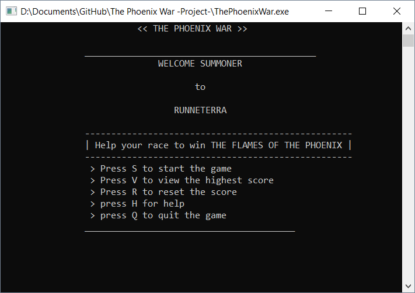
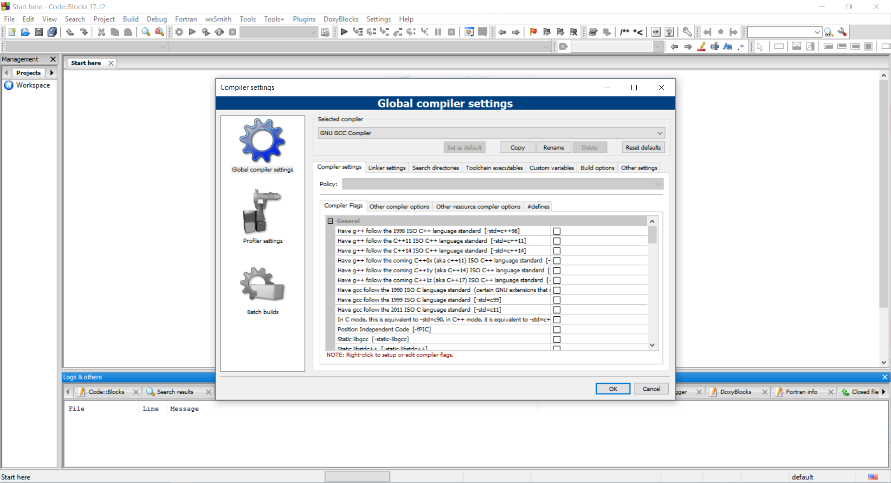

# -Project- The Phoenix War

> "The Phoenix war" is an role & quiz game coded in C.


## Description

The Phoenix war is a solo role-playing game (RPG) released in 2019 by two ENST's student. It is the first released game set in the RUNETERRA fantasy universe, without any dynamic graphics, and was inspired by the [Warcraft III: The Frozen Throne mod, Defense of the Ancients](https://en.wikipedia.org/wiki/World_of_Warcraft#Starting_a_character_or_play_session) & [League of Legend](https://en.wikipedia.org/wiki/League_of_Legends).

   In The Phoenix War, players assume the role of an unseen "summoner"
that controls a "Hero" with some abilities and battle an other race.The goal is to win the power of 'The Flames Of The Phoenix'.

### Gameplay

The Phoenix war is a non-graphic game coded in C. The game consist of one game mode; there is different ways to finish the game, each hero you choose will impact the story mode. To win, the summoner have to answer correctly some questions, like a quiz... But for some Hero either you die before you start or you win by answering just one question. Ups to you to discover!



### Rules

There is no specific rules in this game you just have to:

- Start the game (exectable file)
- Enter your name
- Choose a race
- Try to answer all the questions (There is a score at the end xD)
- Do not die
- Enjoy it!

<strong>Note<strong>: For More Help Press 'H' key when launching the game.

### Structure and functions

Almost 540 lines of codes written in C to ensure a good user experience.
>some of the used functions & Libraries:

- The libraries:

```C
/* The stdio.h header defines three variable types, several macros, and various functions for performing input and output. */
#include <stdio.h>
/* The conio.h is a C header file used mostly by MS-DOS compilers to provide console input/output. It is not part of the C standard library or ISO C, nor is it defined by POSIX. */
#include <conio.h>
/* The stdlib.h header defines four variable types, several macros, and various functions for performing general functions. */
#include<stdlib.h>
/* The windows.h is a Windows-specific header file for the C and C++ programming languages which contains declarations for all of the functions in the Windows API, all the common macros used by Windows programmers, and all the data types used by the various functions and subsystems. */
#include<windows.h>
```

- The record screen (showing the scrore...) reading the score of the txt file and showing it on the screen with a simple open/read/close file:

```C
void show_record(){
system("cls");
char name[20];
float scr;
FILE *f;
f=fopen("score.txt","r");
fscanf(f,"%s%f",&name,&scr);
printf("\n\n\t\t_______________________________________________________");
printf("\n\n\t\t %s has secured the Highest Score %0.2f",name,scr);
printf("\n\n\t\t_______________________________________________________");
fclose(f);
getch();}
```

- The edit score function:

```C
void edit_score(float score, char plnm[20]){
system("cls");
float sc;
char nm[20];
FILE *f;
f=fopen("score.txt","r");
fscanf(f,"%s%f",&nm,&sc);
if (score>=sc){
 sc=score;
 fclose(f);
 f=fopen("score.txt","w");
 fprintf(f,"%s\n%.2f",plnm,sc);
 fclose(f);}}
```

- Some cool stuff I discovered while doing this project:

```C
system("cls"); /* Clearing the previous screen */

system("COLOR XY"); /* Changing the syntax/Background color */

Sleep(X); /* Makes the program sleep for X(ms) */

PlaySound(TEXT("PATH//..//file.wav"),NULL,SND_ASYNC | SND_LOOP | SND_FILENAME);/* playing a background music while the game is running */

toupper(getch());/* analyse the the charactere that has been typed by the user */

(strcmp(str1,str2)==0);/* comparing between two strings using (strcmp) */

getch();
goto X;/* when the user prees any key the prog will automatically go to the "X" page */
```

## Setup
You can either launch it from the .exe file or in a text editor with the .C file (VsCode, Notepad++, CodeBlocks, Dev++, ...)

### CodeBlocks

To get the PlaySound function to work correctly , you have to include -lwinmm in the linker
>What's -lwinmm?

>in MinGW libwinmm.a is an import library for the standard windows system file winmm.dll

- Step1: go to >>Settings>> Compiler...


- Step2: go to >> Linker settings...



- Step3: add "-lwinmm" on >> Other linker options...


Done? Easy you see!

## Contribution

Me 'KyuCore'(s_benmahrez@enst.dz) & Aimen Mohamed Zennoune (m_zenoune@enst.dz)
Our names on the Help Game page!!

### License

